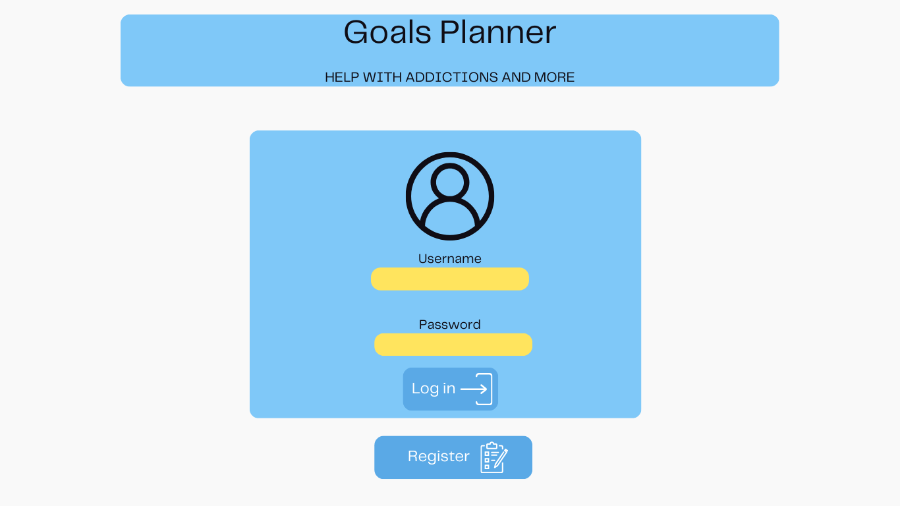
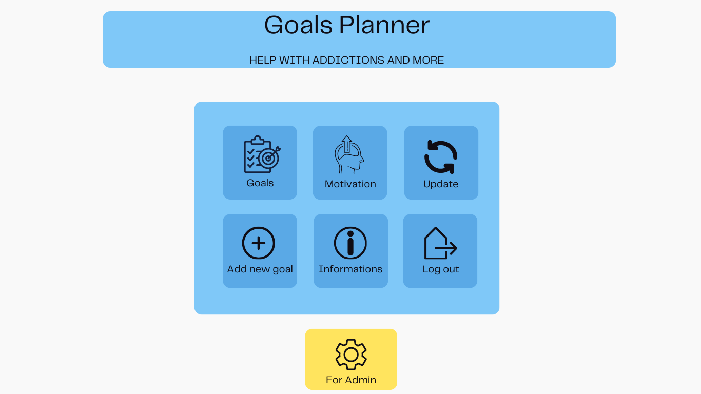

# Documentation: "Goals Planner"

## **Introduction**

The "Goals Planner" is a web application designed to help users manage and track their habits, goals, and progress in overcoming addictions or building positive routines. It provides an intuitive interface to set personal objectives, monitor daily achievements, and stay motivated through tailored features.

This application is particularly useful for individuals who wish to improve their lifestyle by maintaining consistency in their habits. Whether it's quitting a bad habit, starting a new one, or just staying on track with daily goals, "Goals Planner" offers the tools and motivation necessary for success.

### **Key Features**
- **Goal Management**: Easily create, track, and edit your personal goals.
- **Motivation Hub**: Access motivational content to inspire and support you in achieving your objectives.
- **Progress Tracking**: View detailed statistics and visualizations of your progress over time.
- **User-Friendly Design**: A simple and modern interface ensures accessibility for all users.
- **Administrative Tools**: Special features for administrators to oversee and manage the app's functionality.

With "Goals Planner," users can transform their aspirations into actionable steps and celebrate small victories every day.

## **1. Login Page**

This is the first screen of the application, allowing users to access their accounts by providing a username and password.

### Features
- **"Username" Field**: Allows users to input their username.
- **"Password" Field**: Allows users to input their password.
- **"Log in" Button**: Verifies the provided credentials and redirects the user to the main menu upon successful login.
- **"Register" Button**: Redirects the user to the registration form for creating a new account.

### UX
- User-friendly yellow fields for easy visibility and interaction.
- Simple and clean design enabling quick login.
- Intuitive icons added to improve understanding of each function.

---

## **2. Main Menu Page**

The main menu serves as the central hub of the application, where users can manage their goals, view progress statistics, and update account settings.

### Features
- **"Goals" Button**: Redirects the user to a section displaying a list of their existing goals.
- **"Motivation" Button**: Shows motivational materials, such as quotes and tips, to encourage the user in achieving their goals.
- **"Update" Button**: Allows users to edit their personal information or settings.
- **"Add New Goal" Button**: Enables users to create a new goal by filling out a simple form.
- **"Informations" Button**: Displays detailed information about the application and its features.
- **"Log out" Button**: Logs the user out and redirects them back to the login page.
- **"For Admin" Button**: Exclusively available for administrators, providing access to the management panel.

### UX
- Intuitive icons make it easier for users to quickly understand each button's function.
- Grid-based layout ensures clear navigation and easy access to features.
- High-contrast colors and clearly separated sections enhance the user experience. Taken from: https://coolors.co/palette/5aa9e6-7fc8f8-f9f9f9-ffe45e.
